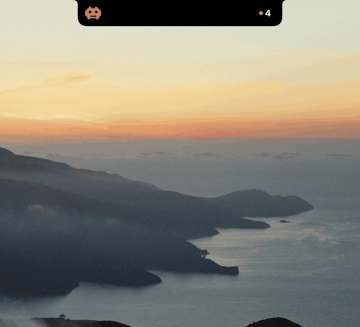

# Notchling

<p align="center">
  <a href="https://github.com/CircleHP/notchling/actions/workflows/ci.yml"></a>
</p>

**A native macOS notch widget that shows what every Claude Code session is doing — and gets you back to
the one that needs you.** Click a row, land in the terminal tab that owns it.

<p align="center">
  
</p>

<p align="center"><i>Resting in the notch, opening by itself when a session blocks on a permission prompt, and
closing again. Nothing is hovered or clicked: the panel drops open because something changed. A second
session finishes while it is open.<br>
Clicking any row activates the terminal tab that owns that session.</i></p>

## Why

Run more than one Claude Code session and you lose track of them. One finishes and sits idle for ten
minutes before you notice. Another is blocked on a permission prompt in a tab you aren't looking at. The
only way to find out is to cycle through tabs and read each one.

Tools that solve this usually do it for a terminal they control — they know which session is which because
they launched it. Notchling never asks your terminal anything: it reads the session registry **Claude Code
already keeps for itself**, and learns terminal identity from the environment variables Claude inherited
from its shell. That works in any terminal, including sessions that were already running before you
installed it.

## What it does differently

**Click a row and you are there.** Not "session 3 needs attention" — the actual tab, brought forward. Warp
via its deep link, iTerm2 and Terminal.app by matching the controlling tty, other terminals by activating
the app. Rows say in their tooltip how precise the jump will be, before you click.

**It is a native app in the notch, not an overlay on your workspace.** No floating always-on-top window to
misclick, because there is no floating window:

- `LSUIElement`, so it has no Dock icon and never appears in Cmd-Tab.
- `ignoresCycle`, so it is not in the window cycle either.
- It can never take keyboard focus — the panel is explicitly barred from becoming the key window, so it
  cannot steal your menu bar or your typing.
- Its window is **exactly the size of what it draws** — 256×32pt when compact, entirely inside the menu
  bar. A window swallows mouse clicks across its whole rectangle whatever it painted there, so any slack
  would be a dead zone over the browser tabs underneath. There is no slack.
- Swift and SwiftUI with **zero dependencies**. Not Electron, not a Python overlay.

## What you see

- **Every session, most urgent first** — interactive and background, discovered with no configuration.
- **"Working" versus "blocked on you"**, which is the distinction that actually matters.
- **Subagents as a subtree.** A fan-out shows each agent, what it is running, which one is blocked, and
  what the finished ones concluded — plus a `3/5 done` headline so "wait or switch tabs" is answerable at
  a glance.
- **Alerts without banners.** The notch drops open for a few seconds and plays a distinct sound. Nothing
  accumulates in Notification Center and nothing needs dismissing.
- **Stalled turns**, judged against what each tool normally takes *here* — so a twelve-minute test run is
  not flagged and a `Read` that never returns is flagged in 45 seconds.
- **`done 4m ago`** on settled rows, so "just finished, go look" is distinguishable from "cold since
  lunch".
- **The name Claude gave it.** A session shows the title Claude derives from the conversation — what
  `claude --resume` lists — rather than a slug that identifies nothing when three are open. A name you
  set yourself always wins, and `/color` puts a coloured bar down the row.
- **Plan usage and per-session context**, optionally. Account-wide limits read the same whichever
  session is on screen.
- **On every screen.** A notched display uses the real notch; every other screen gets a drawn one, same
  shape and behaviour.

It sends nothing anywhere: no network calls, no telemetry, nothing written outside its own directories
and `~/.claude/settings.json`. It does read one thing from a session's transcript — the title Claude
derives and a colour set with `/color`, both recorded nowhere else — by scanning backwards from the end
for those two entries. That happens on your machine and stays there. At rest it costs 0.0–0.1% CPU.

## Install

```sh
brew install CircleHP/notchling/notchling
notchling-hooks setup
```

`setup` asks before it changes anything: it wires the Claude Code hooks, offers the plan-usage status
line, and starts the widget now and at login. Then restart any Claude sessions that were already
running, so they pick up the hooks.

Nothing is compiled — the formula installs a prebuilt universal bundle, so no Xcode and no toolchain.
Nothing is downloaded through a browser either, which is what would attach the quarantine attribute
that makes macOS demand a notarized app, so there is no Gatekeeper dialog, no Apple certificate to buy
and nothing to notarize.

Use the full `CircleHP/notchling/notchling` name rather than tapping first: Homebrew trusts a
third-party tap when you name it in full, and a bare `brew install notchling` will be refused.

Two commands come with it: `notchling-hooks`, which prints what it can do when run with no
arguments, and `notchling-sessions`, which lists what the widget can see and is the first thing to
reach for when a row looks wrong.

### Hooks from a plugin instead

The hooks can come from a Claude Code plugin, in which case nothing edits `~/.claude/settings.json` at
all and removing the plugin removes the wiring. Inside Claude Code:

```
/plugin marketplace add CircleHP/notchling
/plugin install notchling@circlehp
```

Use one route or the other, never both — plugin hooks merge with the ones in `settings.json`, so two
copies report every event twice. `notchling-hooks setup` notices if that has happened and offers to
undo it.

### Building it yourself

For contributors, and for anyone who would rather not run a binary they did not compile:

```sh
brew install --HEAD CircleHP/notchling/notchling
```

or from a clone, which also wires the hooks and launches the app in one step:

```sh
git clone https://github.com/CircleHP/notchling.git
cd notchling
make install
```

Either needs macOS 14+, a Swift 6 toolchain (Xcode 16+ or its Command Line Tools) and `jq`.

### Upgrading

```sh
brew upgrade notchling
brew services restart notchling
```

The restart is not optional: Homebrew replaces the files but leaves the running app alone, so the
widget keeps running the version it started with until something restarts it. From 1.1.0 the panel says
so too — it notices a version on disk that is not the one it is running, and offers to restart into it —
but it looks every six hours rather than continuously, so an upgrade can land long before it is
mentioned. Restart rather than wait to be told.

Nothing needs rewiring. The hooks record `$(brew --prefix)/bin/notchling-hook` and the status line the
`opt` path, both of which Homebrew repoints at the new version. On the plugin route, `/plugin update
notchling@circlehp` picks up the new hooks.

If you use the **iTerm2 or Terminal.app** jump, macOS asks for permission to control them again after
an upgrade — an ad-hoc signature's identity changes with every build, so the previous grant no longer
matches. Warp is unaffected.

### What it does to your machine

Whichever route, the only file outside its own install directory that Notchling touches is
`~/.claude/settings.json`, it backs that up first, and it **appends** to the existing hook arrays so
other tools' hooks survive. The Homebrew formula never touches it: a package manager rewriting another
tool's configuration would be invisible and undone by nothing, which is why `setup` is a separate
command that asks.

The app signs itself ad-hoc, which is free and requires no Apple account. One consequence, and only for
people using the **iTerm2 or Terminal.app** jump: macOS asks permission to control them the first time,
and asks again after an upgrade, because an ad-hoc signature's identity changes with every build. A free
Apple Development certificate makes the grant stick — [SETUP.md](SETUP.md#how-much-signing-you-need) has
the three steps. **Warp needs none of this**: that jump is a URL, not AppleScript.

Full setup, preferences, terminal compatibility and troubleshooting: **[SETUP.md](SETUP.md)**.

## Docs

**[SETUP.md](SETUP.md)** — requirements, install, preferences, terminal compatibility, signing, uninstall
and troubleshooting.

## Status

Notchling reads surfaces Claude Code and Warp do not formally document — the session registry, the shape
of subagent hook payloads, and a Warp environment variable. Every one of them is decoded defensively and
degrades to something still usable rather than failing, so the widget keeps working when a field it does
not recognise appears. If something ever does stop working, a Claude Code or Warp update is the first
thing to check.

Every push and pull request is built and tested on **macOS 15 and macOS 26**: a release build with
warnings treated as errors, the full suite, and the signed `.app` that `make install` assembles. The badge
at the top reports the state of `main` — so what a clone gets you is whatever that badge last said.

## Contributing

Pull requests welcome — **[CONTRIBUTING.md](.github/CONTRIBUTING.md)** has what to run before opening
one, and why the title of a pull request matters more here than in most repos: merges are squash-only,
so it becomes both the commit and the line in the release notes.

The code carries its reasoning in comments — the constraints that are easy to break by accident are
written down next to the code that depends on them.

## License

MIT, all of it — see [LICENSE](LICENSE). The mascot is original art, so there are no carve-outs.

Notchling is unofficial and not affiliated with Anthropic. See [NOTICE.md](NOTICE.md).
