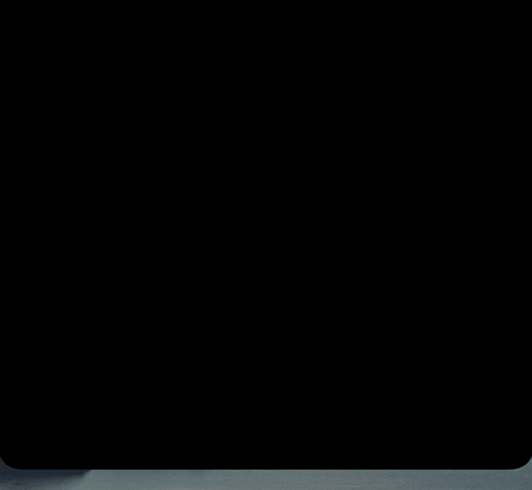

# Setup and configuration

Everything operational: requirements, install, preferences, signing, uninstall, and what to check when
something looks wrong. The [README](README.md) covers what the thing is; this is how to run it.

## Requirements

| | |
|---|---|
| macOS | 14 Sonoma or later |
| Hardware | any Mac. A notched display uses the real notch; every other screen gets a drawn one |
| Homebrew | for the install below. Not needed if you build from source |
| Swift | 6.0 toolchain (Xcode 16+, or its Command Line Tools) — **only** to build from source |
| `jq` | used by the hook installer and the status line. Homebrew installs it for you |
| Claude Code | any recent version |
| Python + Pillow | *only* to regenerate the app icon; the built icon is committed |

Signing: **ad-hoc works fine.** A certificate is optional and only affects the AppleScript focus path —
see [How much signing you need](#how-much-signing-you-need).

## Install

```sh
brew install CircleHP/notchling/notchling
notchling-hooks setup
```

Nothing compiles: the formula pours a prebuilt universal bundle, so no Xcode and no toolchain. Nothing
is downloaded through a browser either, which is what attaches the quarantine attribute that makes
macOS demand a notarized app — so there is no Gatekeeper dialog and no certificate to buy.

Name the formula in full. Homebrew trusts a third-party tap when you name it in full, so a bare
`brew install notchling` after tapping is refused.

`notchling-hooks setup` asks three questions and acts on the answers: wire the Claude Code hooks, add
the plan-usage status line, start the widget now and at login. Each is available on its own —
`notchling-hooks install`, `notchling-hooks statusline`, `brew services start notchling` — and
`notchling-hooks` with no arguments prints what it can do.

Then restart any Claude sessions that were already running so they pick up the hooks. They still
*appear* immediately, they just won't report fine-grained state until restarted.

### Hooks from a plugin instead

The hooks can come from a Claude Code plugin, in which case nothing edits `~/.claude/settings.json` at
all, and removing the plugin removes the wiring. Inside Claude Code:

```
/plugin marketplace add CircleHP/notchling
/plugin install notchling@circlehp
```

Use one route or the other, never both: plugin hooks merge with the ones in `settings.json`, so two
copies report every event twice. `notchling-hooks setup` detects that and offers to undo it. The status
line stays with `notchling-hooks` either way, because plugins cannot register one.

### From source

For contributors, and for anyone who would rather not run a binary they did not compile:

```sh
brew install --HEAD CircleHP/notchling/notchling
```

or from a clone, which builds, signs, installs to `~/Applications`, wires the hooks and launches it in
one step:

```sh
git clone https://github.com/CircleHP/notchling.git
cd notchling
make install
make statusline    # optional: plan-usage bars, see the trade-off below
make autostart     # optional: start at login
```

### What the install writes

Whichever route, the only file outside its own install directory that Notchling touches is
`~/.claude/settings.json`. It backs it up first, **appends** to the existing per-event hook arrays
rather than replacing them (so other tools' hooks survive), verifies the result is valid JSON with
exactly one entry per event, and refuses to touch a settings file it cannot parse.

The Homebrew formula itself never touches that file: a package manager rewriting another tool's
configuration would be invisible and undone by nothing on uninstall, which is why `setup` is a separate
command that asks.

## Reading the widget

<p align="center">
  
</p>

The mascot is present in every state, and the state changes its **face** and **colour**:

| state | face | colour | motion |
|---|---|---|---|
| working | open eyes, straight mouth | clay | feet swing, 2 frames a second |
| needs you | frowning | red | blinking |
| finished | eyes squinted, smiling | green | shimmering |
| failed | frowning | red | blinking |
| idle | straight mouth | clay, dimmed | none at all |

Sounds, when a session changes state: Submarine for needs-you, Glass for done, Basso for failed, Tink
for a stalled turn. Each fires once per edge.

**Rows** are sorted most-urgent first and show the session name, what it's doing right now, elapsed time
for the current turn, and a context meter. Hover a row for its working directory, the task it was given,
and whether focus will be precise. Click it to jump there.

**Subagent rows** are indented under the session that spawned them, with their own tool, elapsed time and
result. A session that fans out shows `3/5 done` instead of a tool name, because the tool a fan-out's main
thread is running is always the one that spawned the agents. Agents appearing or finishing show on the next
open rather than while you hover — a list reflowing under the pointer is worse than a moment's delay.

## Plan usage and per-session context

Both are behind `notchling-hooks statusline` (or `make statusline` from a clone), and here's the
honest trade-off: `rate_limits.*` and
`context_window.*` are handed to Claude Code's **status line** and to nothing else — no hook payload
carries them and nothing under `~/.claude` caches them. So reading them means registering a status
line, and **configuring any status line makes Claude Code stop showing some of its footer hints**
(`esc to interrupt`, `? for shortcuts`).

Since a row is being spent either way, the script prints something worth it:

```
Opus 5  my-project  ctx 37%  5h [████······] 57% left ⟳ 2h10m  7d 88%
```

`notchling-hooks no-statusline` removes it. The installer refuses to overwrite a status line it didn't write, and
the remover refuses to delete one — so both are safe to run if you already have your own.

**This needs a session restart, and nothing does it for you.** Claude Code reads `statusLine` at
session start, exactly as it reads hooks, so adding it from inside a live session does nothing for that
session however long you wait. Restart it; `~/.notchling/usage.json` appears
the first time a restarted session renders its status line, and the bars are drawn in the **expanded
panel** rather than on the compact strip, so open the notch to see them.

Because a status line only runs while its session is on screen, these numbers go stale when nothing is
running. The panel dims them and says so rather than presenting old numbers as current.

## Terminal compatibility

Session **discovery** does not depend on your terminal at all — it comes from Claude Code. Every
session shows up in every terminal. What varies is how precisely *click-to-focus* can land.

| Terminal | Appears in the panel | Click-to-focus | How |
|---|---|---|---|
| **Warp** | yes | brings Warp forward, on the right pane | `WARP_FOCUS_URL` deep link † |
| **iTerm2** | yes | selects the window, tab and pane owning the tty | AppleScript ‡ |
| **Terminal.app** | yes | selects the window and tab owning the tty | AppleScript ‡ |
| **VS Code / Cursor** integrated terminal | yes | activates the editor | bundle identifier |
| **Ghostty, kitty, Alacritty, WezTerm** | yes | activates the app | `__CFBundleIdentifier` |
| **tmux / screen** | yes | unreliable — see below | — |
| Session over SSH on another host | no | — | the app reads local files only |

† `WARP_FOCUS_URL` is undocumented — the request to document it
([warpdotdev/warp#8611](https://github.com/warpdotdev/warp/issues/8611)) is still open — but it ships in
every Warp shell, and opening it brings Warp forward.

‡ Matched on the controlling tty. Terminal.app is confirmed working; iTerm2 takes the same code path
against a richer object model and also selects the pane.

**tmux caveat.** A Claude process inside tmux inherits its environment from the tmux *server*, not from
the window you're looking at. So `WARP_FOCUS_URL` points at whichever pane started the server — which
may not exist any more — and the tty is a tmux pty rather than a terminal window. The session still
appears correctly; focus is a coin flip.

Rows whose focus can only be approximate say so in their tooltip, so you can tell before you click.

## Displays

By default the widget appears on **every** screen: the physical notch on a built-in display, and a
drawn one — same shape, same size, same behaviour — at the top centre of everything else. Nothing to
configure.

Two preferences, both read at launch:

```sh
# Which screens to appear on.
defaults write local.notchling displayMode -string all      # all (default) | active | builtin
#   all      every screen
#   active   only the screen the pointer is on
#   builtin  only a screen with a physical notch — nothing at all if there isn't one

# How big the panel is on external monitors.
defaults write local.notchling externalScale -string large  # normal (default) | large
```

Then restart the app: `brew services restart notchling`, `make restart` from a clone, or quit it
from the panel and reopen.

What to expect:

- **`externalScale` does not touch a notched display.** The built-in panel is a small, dense screen
  with a fixed 32pt cutout and the widget there is already the right size; external monitors are the
  ones with space going spare. So the built-in always renders exactly as it did before any of this.
- **It scales the panel, not the compact strip.** The strip lives in the menu bar and there is nothing
  in it that wants more room.
- **A peek opens on one screen** — the one the pointer is on. Hovering beats a peek, so if you are
  already looking at the widget on another screen, that is the one that opens.
- **The compact mascot may be slightly larger on a 1× display.** It is pixel art, so it is only crisp when
  one grid pixel covers a whole number of device pixels; on a 1× monitor that rounds it up a little.
- Both drawn and physical notches sit above the menu bar and above full-screen windows, on every Space, and
  the window is never larger than what it draws — so it cannot swallow a click meant for something else.

## Overrides

| | |
|---|---|
| `NOTCHLING_PREVIEW=<state>` | force one mascot state, for looking at it |
| `NOTCHLING_FPS=n` | override the frame rate |
| `NOTCHLING_STILL=1` | freeze the mascot |
| `NOTCHLING_STALL_SECS=n` | change the stalled-turn threshold from 600s |
| `NOTCHLING_FORCE_PILL=1` | treat every screen as notchless, to see the drawn notch on a notched Mac |
| `NOTCHLING_ANIM=n` | slow the grow/shrink animations down n times, for inspecting them |

## Building and signing

### The targets

These are for a source checkout. A Homebrew install has `notchling-hooks` for the wiring,
`brew services start|stop notchling` for running it, and `notchling-sessions` for the session list.

```sh
make build       # swift build -c release
make test        # build the hook binary, then run the test suite
make bundle      # assemble + sign .build/bundle/Notchling.app
make install     # bundle → ~/Applications, register with LaunchServices, wire hooks, launch
make run         # launch the installed app
make stop        # quit it
make restart
make icon        # regenerate Resources/Notchling.icns from the source art (needs Pillow)
make sessions    # list every Claude session and what each one really is
make clean
```

`make bundle` assembles the `.app` by hand rather than through Xcode: `Info.plist`, the icon, the
status-line script, the two binaries, `PkgInfo`, then `codesign` on the inner helper binary first and
the bundle second, so the outer signature seals a tree that has stopped changing.

You can also run the binary straight out of `swift build` — quickest way to iterate on the notch UI. It
just has no icon and no bundle identity, so the single-instance guard is inert.

### How much signing you need

**Ad-hoc is enough.** With no certificate at all, `make install` signs with `--sign -`, prints a note,
and everything works.

There is one reason to want a real certificate. macOS grants AppleEvents permission against an app's
*code signature*, and an ad-hoc signature's hash changes on every rebuild — so if you use the iTerm2 or
Terminal.app focus path, macOS re-asks for permission after each reinstall. A certificate keeps the
grant. **Warp users can ignore this entirely**: that path is a URL open, not AppleScript, and needs no
permission.

An **Apple Development** certificate is free and needs only an Apple ID, not a paid account:

1. Xcode → Settings → Accounts, add your Apple ID.
2. Select the account → **Manage Certificates…** → **+** → **Apple Development**.
3. Check it landed:

```sh
security find-identity -v -p codesigning
#   1) A1B2C3… "Apple Development: you@example.com (TEAMID)"
```

This step needs full Xcode, not just the Command Line Tools. The Makefile picks the first Apple
Development identity it finds; override with `make install SIGN_ID=<hash>`, or force ad-hoc with
`make install SIGN_ID=`.

Notarization is irrelevant here: you built it locally, so Gatekeeper never gates it. It would only matter
for a prebuilt binary someone downloads, which is not how this is distributed.

### Forking or renaming

If you change `CFBundleIdentifier`, run `make icon && make bundle` **before** the new id first reaches
LaunchServices. macOS caches an app's icon association against its bundle id from first registration,
and an id first seen without an icon keeps showing a placeholder in some system UI afterwards. Nothing
reliably clears it.

## What it touches

| Path | |
|---|---|
| `~/.claude/settings.json` | hook entries, plus an optional status line. Backed up on every change. |
| `~/.notchling/events/` | the hook spool. Written by `notchling-hook`, drained and deleted by the app. |
| `~/.notchling/usage.json` | plan limits, written by the status line. |
| `~/.notchling/sessions/` | per-session context and model. Pruned after 3 days. |
| `$(brew --prefix)/opt/notchling/Notchling.app` | the app, installed by Homebrew. Version-independent path. |
| `$(brew --prefix)/bin/notchling-hook`, `-hooks`, `-sessions` | the helpers, on `PATH`. Repointed by every upgrade. |
| `~/Library/LaunchAgents/homebrew.mxcl.notchling.plist` | only with `brew services start notchling`. |
| `~/Applications/Notchling.app` | the app, if you installed from a clone instead. |
| `~/Library/LaunchAgents/local.notchling.plist` | only with `make autostart`. |
| `~/.claude/sessions/` | **read only** — Claude Code's own registry. |

## Uninstall

Unwire the hooks first, while the command that knows how to still exists:

```sh
notchling-hooks uninstall
notchling-hooks no-statusline
brew services stop notchling
brew uninstall notchling
brew untap CircleHP/notchling
```

`uninstall` removes only the entries it installed, and `no-statusline` refuses to remove a status line
it did not write, so both are safe alongside other tools. Homebrew does not delete `~/.notchling`, so
remove it by hand if you want the session state gone too. The `settings.json` backups are left behind
deliberately.

From a clone, `make uninstall` does all of the above for that install, including deleting
`~/.notchling`.

## Troubleshooting

**A session shows only `idle`/`working`, never `needs you`** — its hooks aren't wired. Hooks are read
at session start, so restart that session. Check with `jq '.hooks.PreToolUse' ~/.claude/settings.json`.

**Subagents don't appear** — the same cause. `SubagentStart` and `SubagentStop` are registered when the
hooks are wired; a session started before that reports nothing about its agents.

**Nothing in the notch at all** — `pgrep -x Notchling`. On a Mac without a notch this is expected:
the widget only appears on hover or on a state change.

**No sounds** — check output volume and whether Do Not Disturb is muting alert sounds. The peek is
independent, so if the panel opens and you hear nothing, it's the audio side.

**macOS keeps asking to control iTerm2 / Terminal** — the bundle is ad-hoc signed, so its signature
changes each reinstall and the permission grant stops matching. See
[How much signing you need](#how-much-signing-you-need).

**A row I don't recognise** — `notchling-sessions` (or `make sessions` from a clone) cross-checks the registry against live process argv and
says what each entry actually is, including Claude Code's own pooled background processes (which the
widget hides).

**Usage bars missing** — four checks, in order. The status line is opt-in, so run
`notchling-hooks statusline` first, or answer yes when `notchling-hooks setup` asks. Then **restart your sessions**: `statusLine` is read at session
start, and a session that was already running will never pick it up however long you wait. Confirm it
landed with `jq '.statusLine.command' ~/.claude/settings.json`. Finally check that
`~/.notchling/usage.json` exists — if it does and the panel still looks bare, the bars are in the
expanded panel only, so open the notch rather than reading the compact strip.
